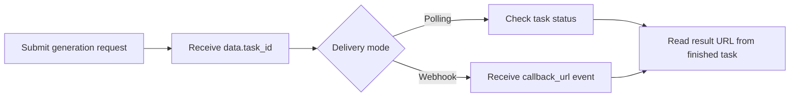

# Wan 2.7 Video API with APIDot

Build with the Wan 2.7 Video API using APIDot: cURL, Node.js, polling, webhooks, pricing, and production notes in one GitHub repo.

[Try on APIDot](https://apidot.ai/models/wan-2-7-video) | [Get API Key](https://apidot.ai/dashboard/api-key) | [API Docs](https://apidot.ai/docs/wan-2-7-video) | [Pricing](https://apidot.ai/pricing) | [Main Examples](https://github.com/APIDotAI/apidot-examples)

## Why this repo exists

Alibaba Wan 2.7 Video API for text-to-video, image-to-video, reference-to-video, and edit-video workflows with 720p or 1080p output.

This repository turns the APIDot workflow into runnable server-side examples: a verified cURL request, a native Node.js polling example, webhook receiver notes, prompt examples, pricing context, and production integration guardrails.

## Overview

Wan 2.7 Video uses APIDot's shared async generation workflow. Send one of the public model IDs in top-level `model`, optional `callback_url`, and the mode-specific parameters inside `input`. The request body is always `{ "model": "...", "callback_url": "...", "input": { ... } }`.

## Capabilities

- Use `wan2.7-text-to-video` when your workflow starts from a prompt only.
- Use `wan2.7-image-to-video` with 1 or 2 URLs in `input.image_urls`; the second image guides the ending frame.
- Use `wan2.7-reference-to-video` when the prompt should follow reference images, reference videos, or both.
- Use `wan2.7-edit-video` with required `input.video_url`; send `duration: 0` or omit duration when APIDot should detect the source video duration.
- Choose `resolution: "720p"` for lower cost, or `1080p` for sharper output.

## Common use cases

- Product and marketing video generation
- Social-first creative testing
- Storyboard previews and prompt iteration
- Backend media workflow prototypes
- Production queues that need polling or webhooks

## Pricing on APIDot

Catalog price: Starting at 12 credits per second | 720p: 12 credits/sec ($0.060), 1080p: 18 credits/sec ($0.090).

| Tier | Model | Resolution | Credits | APIDot listed price | fal.ai listed price |
| --- | --- | --- | ---: | ---: | ---: |
| 720p text-to-video | wan2.7-text-to-video | 720p | 12 | $0.06 | $0.1 |
| 1080p text-to-video | wan2.7-text-to-video | 1080p | 18 | $0.09 | $0.15 |
| 720p image-to-video | wan2.7-image-to-video | 720p | 12 | $0.06 | $0.1 |
| 1080p image-to-video | wan2.7-image-to-video | 1080p | 18 | $0.09 | $0.15 |
| 720p reference-to-video | wan2.7-reference-to-video | 720p | 12 | $0.06 | $0.1 |
| 1080p reference-to-video | wan2.7-reference-to-video | 1080p | 18 | $0.09 | $0.1 |
| 720p edit-video | wan2.7-edit-video | 720p | 12 | $0.06 | $0.1 |
| 1080p edit-video | wan2.7-edit-video | 1080p | 18 | $0.09 | $0.1 |

This README uses pricing data currently published in the APIDot model catalog. Check the APIDot model page before high-volume production runs.

## Quick start

    cp .env.example .env
    # Edit .env and set APIDOT_API_KEY
    cd node
    npm start

The same request shape is available as a copy-paste cURL example in curl/generate.md.

## API workflow



Use polling for local tests and webhook delivery for production queues. Store `data.task_id` before the first status check so retries, callbacks, and result URLs can be reconciled safely.

## Minimal API request

Submit to APIDot's unified async generation endpoint:

    POST https://api.apidot.ai/api/generate/submit
    Authorization: Bearer <APIDOT_API_KEY>
    Content-Type: application/json

Primary payload:

```json
{
  "model": "wan2.7-text-to-video",
  "input": {
    "prompt": "A cinematic tracking shot of a glass greenhouse at sunrise, soft light, slow camera movement.",
    "aspect_ratio": "16:9",
    "resolution": "720p",
    "duration": 5
  }
}
```

Submit Wan 2.7 text-to-video, image-to-video, reference-to-video, or edit-video jobs through APIDot's unified async generation endpoint.

## Model IDs and request variants

### wan2.7-text-to-video

```json
{
  "model": "wan2.7-text-to-video",
  "callback_url": "https://your-domain.com/callback",
  "input": {
    "prompt": "A cinematic tracking shot of a glass greenhouse at sunrise, soft light, slow camera movement.",
    "aspect_ratio": "16:9",
    "resolution": "720p",
    "duration": 5,
    "audio_url": "https://your-domain.com/audio.mp3",
    "seed": 24680,
    "enable_safety_checker": true
  }
}
```

### wan2.7-image-to-video

```json
{
  "model": "wan2.7-image-to-video",
  "callback_url": "https://your-domain.com/callback",
  "input": {
    "image_urls": [
      "https://your-domain.com/start-image.webp",
      "https://your-domain.com/end-image.webp"
    ],
    "prompt": "Animate the product with a slow dolly-in and realistic reflections.",
    "resolution": "1080p",
    "duration": 6,
    "audio_url": "https://your-domain.com/audio.mp3",
    "multi_shots": false
  }
}
```

### wan2.7-reference-to-video

```json
{
  "model": "wan2.7-reference-to-video",
  "callback_url": "https://your-domain.com/callback",
  "input": {
    "prompt": "Create a polished product hero video using the references for subject identity and lighting style.",
    "reference_image_urls": [
      "https://your-domain.com/reference-1.webp"
    ],
    "reference_video_urls": [
      "https://your-domain.com/reference-video.mp4"
    ],
    "aspect_ratio": "9:16",
    "resolution": "720p",
    "duration": 5,
    "multi_shots": true
  }
}
```

### wan2.7-edit-video

```json
{
  "model": "wan2.7-edit-video",
  "callback_url": "https://your-domain.com/callback",
  "input": {
    "prompt": "Restyle the source clip as a premium winter sports commercial while keeping the original motion.",
    "video_url": "https://your-domain.com/source-video.mp4",
    "reference_image_url": "https://your-domain.com/reference-image.webp",
    "aspect_ratio": "16:9",
    "resolution": "1080p",
    "duration": 0,
    "multi_shots": false,
    "audio_setting": "auto"
  }
}
```

## Request parameters

| Field | Type | Required | Description |
| --- | --- | --- | --- |
| model | string | yes | Target public model ID: `wan2.7-text-to-video`, `wan2.7-image-to-video`, `wan2.7-reference-to-video`, or `wan2.7-edit-video`. |
| callback_url | string | no | Optional webhook URL for terminal task updates. |
| input.resolution | string | no | Output resolution. Supported values are `720p` and `1080p`. |
| input.seed | integer | no | Optional random seed from `0` to `2147483647`. |
| input.enable_safety_checker | boolean | no | Optional upstream safety checker flag. |
| input.prompt | string | yes | Required for text-to-video, reference-to-video, and edit-video. Optional for image-to-video. |
| input.aspect_ratio | string | no | Supported for text-to-video, reference-to-video, and edit-video. Values: `16:9`, `9:16`, `1:1`, `4:3`, `3:4`. |
| input.duration | integer | no | Text-to-video: `5`, `10`, or `15`. Image-to-video: `2`-`15`. Reference-to-video: `2`-`10`. Edit-video: `0` for auto detection, or `2`-`10`. |
| input.audio_url | string | no | Optional audio URL for text-to-video and image-to-video. |
| input.image_urls | string[] | no | Required for image-to-video. Send one or two image URLs; the second URL guides the ending frame. |
| input.video_url | string | no | Required source video URL for edit-video. Do not send this field with image-to-video. |
| input.reference_image_urls | string[] | no | Reference-to-video image references. Up to 9 URLs. At least one of `reference_image_urls` or `reference_video_urls` is required for reference-to-video. |
| input.reference_video_urls | string[] | no | Reference-to-video video references. At least one reference image or reference video is required for reference-to-video. |
| input.reference_image_url | string | no | Optional single reference image URL for edit-video. |
| input.multi_shots | boolean | no | Optional boolean supported for image-to-video, reference-to-video, and edit-video. |
| input.audio_setting | string | no | Optional string for edit-video. |

## Practical integration notes

- Keep APIDot API keys in server-side environment variables.
- Persist task_id, selected model, request payload, user ID, and status together.
- Poll at a moderate interval for local tests and use webhooks for durable production callbacks.
- Validate source media URLs before submitting requests that depend on source files.
- Avoid logging API keys, private prompts, private media URLs, or callback URLs.

## Polling and webhooks

APIDot media generation is asynchronous. Store `data.task_id` immediately after submit, poll `/api/generate/status/{task_id}` for local tests, and use `callback_url` webhooks for production queues where users may leave the page before completion.

Webhook handlers should verify task ownership, persist callback events, return 2xx quickly, and be idempotent because duplicate deliveries can happen.

## Response and errors

- `code`: HTTP-style status code. Successful submits return `200`.
- `data.task_id`: Async task identifier returned immediately after submission.
- `data.status`: Initial task status, typically `not_started`.
- `data.created_time`: ISO 8601 timestamp for task creation.

Common error classes:

- `400 invalid_request`: Missing fields or unsupported parameter combinations.
- `401 authentication_error`: Missing, expired, or invalid Bearer API key.
- `402 insufficient_credits`: The current prepaid balance cannot cover the job.
- `429 rate_limited`: Submission rate is temporarily above the current allowed limit.

## Production notes

- Keep APIDot API keys in server-side environment variables.
- Persist task_id, selected model, request payload, user ID, and status together.
- Use a moderate polling interval for tests and webhooks for durable production callbacks.
- Validate source media URLs before submitting requests that depend on source files.
- Avoid logging API keys, private prompts, private media URLs, or callback URLs.
- Retry transient network failures with backoff, but do not retry unchanged invalid payloads.

## FAQ

### Which model IDs are supported?

`wan2.7-text-to-video`, `wan2.7-image-to-video`, `wan2.7-reference-to-video`, and `wan2.7-edit-video`.

### What is the shared request shape?

Send the public model ID at the top level, optional `callback_url`, and all generation controls inside `input`.

### How do edit references differ from reference-to-video references?

Reference-to-video accepts plural `reference_image_urls` and `reference_video_urls`. Edit-video accepts one optional singular `reference_image_url` with the required source `video_url`.

## Related links

- Website: https://apidot.ai
- Docs: https://apidot.ai/docs
- Wan 2.7 Video docs: https://apidot.ai/docs/wan-2-7-video
- Wan 2.7 Video model page: https://apidot.ai/models/wan-2-7-video
- GitHub repo: https://github.com/APIDotAI/wan-2-7-video-api
- Main examples: https://github.com/APIDotAI/apidot-examples
